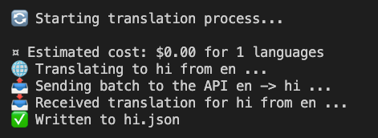

# json-i18n-whisper

A Node.js package to translate JSON files using Google Cloud Translate API. This tool helps you quickly translate your JSON language files into multiple languages, making internationalization of your projects easier.



## Features

- Translates JSON files to multiple languages simultaneously
- Supports nested JSON structures
- Estimates translation cost before processing
- Uses Google Cloud Translate API for accurate translations
- Handles special cases for languages like Hebrew and Arabic

## Installation

You can install this package globally using npm or yarn:

```bash
npm install -g json-i18n-whisper
# or
yarn global add json-i18n-whisper
```

## Prerequisites

- A Google Cloud Platform account with the Translate API enabled
- A Google Cloud API key with access to the Translate API

## Usage

### Command Line Interface

You can run the script using the following command:

```bash
translate-json <inputLang> <targetLangs> [apiKey]
```

- `<inputLang>`: The source language code (e.g., 'en' for English)
- `<targetLangs>`: Comma-separated list of target language codes (e.g., 'fr,es,de')
- `[apiKey]`: (Optional) Your Google Cloud Translate API key. If not provided, the script will look for the GOOGLE_TRANSLATE_API_KEY environment variable.

Examples:

1. Using an environment variable:

   ```bash
   export GOOGLE_TRANSLATE_API_KEY=your_api_key_here
   translate-json en fr,es,de
   ```

2. Providing the API key as an argument:
   ```bash
   translate-json en fr,es,de your_api_key_here
   ```

This will translate the `en.json` file to French, Spanish, and German, creating `fr.json`, `es.json`, and `de.json` files.

### Importing the Function Directly

You can also import the `translateJson` function directly in your Node.js code:

```javascript
const translateJson = require("json-i18n-whisper");

translateJson("en", "fr,es", "your_api_key_here");
```

## How it works

1. The tool reads the input JSON file (e.g., `en.json`)
2. It estimates the translation cost based on the text length and number of target languages
3. The JSON is recursively traversed, and all string values are collected for translation
4. Translations are performed in batches using the Google Cloud Translate API, which is chosen for its superior quality and speed compared to GPT-4o and other LLM or translation services.
5. The translated strings are then reassembled into the original JSON structure
6. Separate output files are created for each target language

## Cost Estimation

Before translation begins, the tool provides an estimated cost based on the current Google Cloud Translate API pricing. This helps you make an informed decision before proceeding with large translations.

## Notes

- This package exclusively uses the Google Cloud Translate API. Make sure you have the necessary API key and billing set up in your Google Cloud Console.
- The actual cost may vary slightly from the estimate due to factors like text complexity and API pricing changes.
- For languages like Hebrew, Arabic, Persian, and Urdu, diacritical marks are automatically removed from the translations to improve readability.

## Testing

This package uses Jest for testing. To run the tests, follow these steps:

1. Install development dependencies:

```bash
npm install
# or
yarn
```

2. Run the tests:

```bash
npm test
# or
yarn test
```

The test suite includes unit tests for core functions and integration tests that mock the Google Cloud Translate API responses.

## License

MIT
